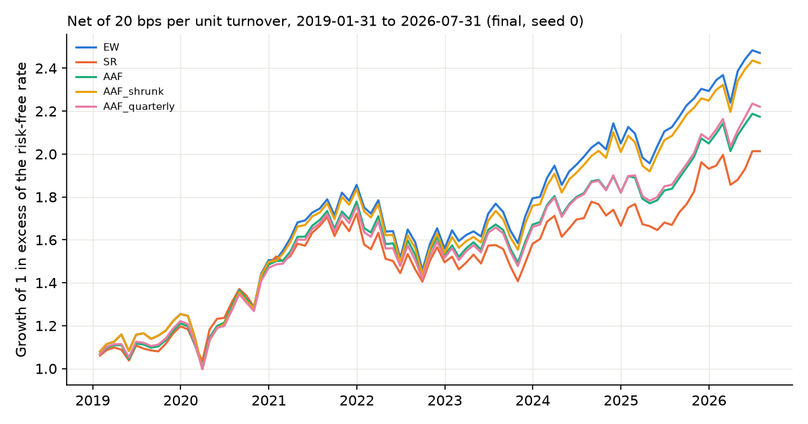

# Asset Allocation Forests: an Exact Leaf Optimizer, When Its Relaxation Matters, and an Out-of-Sample Test

This repository re-implements the Asset Allocation Forest of Bettencourt, Petukhina & Tetereva
(SSRN 4781685): random-forest partitions of market states whose leaves hold maximum-return
portfolios at the equal-weight volatility. Its main technical work is the leaf problem.
It has an exact solver for the nonconvex equality-constrained problem and a short
characterization of when the convex relaxation changes the optimal value. It also measures how
often that happens on the problems a forest actually meets. The forest itself is then tested out
of sample, where it shows no benefit that pays for its turnover.

## Background

This project started in the ML in Finance course at the New Economic School (NES). I later extended it with an exact face-enumeration solver for the nonconvex leaf problem, an exact solution of its convex relaxation with a short proof of when the two optimal values differ, a paired count of that difference on node problems met during forest growth, a solver benchmark, and an out-of-sample transfer to Kenneth French's five industry portfolios. Development used AI coding assistance; the reviews mentioned in this repository's documents were AI-assisted, not independent human audits.

**The leaf problem and its exact solution.** Maximize mu'w subject to w'Sigma w = v (the
equal-weight variance), 1'w = 1, w >= 0: the simplex intersected with the surface of an
ellipsoid, a nonconvex set. `solve_leaf_exact` enumerates all 2^N - 1 faces of the simplex and
solves each face's stationarity conditions in closed form. It keeps both Lagrange roots and treats
degenerate, singular and zero-variance faces explicitly. It is exact but exponential in N: about
1 ms for five assets and 36 ms for ten (1,023 faces) on the benchmark machine, not a method for
hundreds of assets. The benchmark ([reports/leaf_benchmark.md](reports/leaf_benchmark.md)) covers
750 deterministic instances with N = 2-6, 8 and 10 in six families: random, near-singular, duplicate
and zero-variance assets, tied means, boundary targets. On them the equality feasibility residual
stayed below 1e-12, and a 20-start SLSQP never beat enumeration by more than round-off (3e-12);
it found a worse point on about half of the boundary instances with N >= 4. The relaxed optimum matched cvxpy to solver
tolerance, and the forest's batched solver matched the exact one.

**When the convex relaxation matters.** For the relaxation (variance at most v), let a and b be
the smallest and largest variance on the face of the best-mean assets (b is the largest variance
of a best-mean asset).
- If a <= v, the relaxed optimum is the best mean.
- If a > v, the constraint binds, and both problems have the same optimal value and the same
  optimizers.
- The relaxed value is therefore strictly higher exactly when v > b, i.e. when every best-mean
  asset has variance below v.

The proof is half a page ([docs/methodology.md](docs/methodology.md)). `tests/test_relaxed_theorem.py`
checks it on bounded random and degenerate families against an interior-point solver (Clarabel),
not against the solver's own case analysis. It also holds one counterexample for each way the
solver's "slack" status (a <= v) can occur without a value gap. The statement is
elementary and is not claimed as new.

**How often it matters** ([reports/paired_value_gap.md](reports/paired_value_gap.md)). Six
development forests passed 317,332 (mean, covariance) problems to the leaf solver during growth
(node values and every candidate split's children). Each was solved under both formulations. The
relaxed value was strictly higher in 18.1% of them, by a median 6.7 bp of monthly expected return.
On a binding problem the relaxed solver returns the equality solution, so agreement there holds
by construction. On the 57,552 slack problems, where it does not, the condition v > b matched the
realized gap in every case (for the 57,522 with a unique best asset this follows from
feasibility; the 30 with tied best means test the enumeration). An interior-point solver (Clarabel) on 4,000 sampled problems agreed
with the exact relaxed values to within 2e-8 and never exceeded an equality optimum on a binding
problem. Slack status without a gap occurred only in 28 problems, all with tied best means.

**Out-of-sample test (Kenneth French five industry portfolios, research return series; 2019-01
to 2026-07, not used for any design decision and evaluated once with the frozen procedure, whose
annual expanding-window refits from 1947 include earlier final-period months, as declared; 20 bps
per unit turnover).** Its first 49 months (2019-01..2023-01) overlap the previously viewed
archival out-of-sample period (different series), so the sample is not calendar-fresh. The forest showed no benefit that would pay for its turnover. Its net Sharpe
ratio was 0.77 against 0.83 for equal weight (seed 0; 0.77 to 0.78 across three seeds), at 178%
annual turnover against 24%. The joint block bootstrap interval for the Sharpe difference runs
from -0.22 to 0.08, so its sign is not resolved, while the turnover difference is large. The
forest's point estimate was behind equal weight even before costs. Shrinkage toward equal weight,
chosen only on earlier out-of-sample months, cut turnover to 36% and ended within 0.01 of equal
weight; with the convex leaf it chose equal weight outright. Development (1947-2018) had shown the
same ordering (net 0.55 against 0.57, interval for the difference -0.07 to 0.04). Neither sample
resolves the difference statistically.

| Seed 0, net Sharpe at 20 bps per unit turnover | French final 2019-01..2026-07 | French development 1947-2018 | Five-asset archival 2003-2023 |
|---|---:|---:|---:|
| Equal weight | 0.83 | 0.57 | 0.52 |
| Forest (paper's equality leaf) | 0.77 | 0.55 | 0.62 |
| Forest with shrinkage toward equal weight | 0.82 | 0.55 | |
| Forest, quarterly updates | 0.78 | 0.57 | 0.63 |
| Forest with the convex (inequality) leaf | 0.77 | 0.54 | |



**Relaxed versus equality forest.** Relaxed minus equality net Sharpe was -0.004 in the French
final (interval -0.017 to 0.014). The two forests also differ in their splits, so this is not a
leaf-level comparison. In the previously viewed archival sample the relaxed forest was slightly
worse (-0.017, interval -0.036 to -0.003).

**Archival reproduction** (the supplied five-asset index data, previously viewed; seed 0, gross
returns as in the paper's Table 5): forest Sharpe 0.64 with 82.8% turnover (paper 0.68 and
81.51), equal weight 0.52 with 27.05% (paper 0.50 and 26.94), unconditional Sharpe portfolio 0.60
(paper 0.58). The workbook's redistribution terms are not established, so the workbook and the
outputs that reproduce its content are not published; `make data-private` explains the local
import.

**Corrections to the starting point.** Three leaf-solver defects in the original course notebook
were found with counterexamples and are kept as regression tests. The notebook is this
repository's starting point, not code from the paper.
1. The second root on two-asset faces was discarded, forcing an equal-weight fallback.
2. Round-off admitted infeasible single-asset faces.
3. Equal means produced portfolios that broke the risk constraint.

A fourth defect was in this project's own first reimplementation: faces with a singular
covariance were skipped although the risk restricted to the face was positive definite.

**Critical limitation.** Five assets and monthly data give 91 final months, so Sharpe differences
smaller than about 0.15 cannot be resolved (the final interval for the forest minus equal weight
spans 0.31). The finding is the absence of a benefit large enough to see, plus
turnover several times higher. State variables for the French transfer are return-derived. The
industry portfolios and the archival indices are research return series, not tradable
instruments, and 20 bps per unit turnover is an assumed cost.

Tables: [reports/results_transfer_french5_final.md](reports/results_transfer_french5_final.md),
[reports/formulations_transfer_french5_final.md](reports/formulations_transfer_french5_final.md),
[reports/results_transfer_french5_dev.md](reports/results_transfer_french5_dev.md),
[reports/results_archival_hw3_dev.md](reports/results_archival_hw3_dev.md); note:
[reports/research_note.md](reports/research_note.md).

```bash
make test                          # leaf solver (exact, relaxed, reference), proposition, forest, accounting
make demo                          # synthetic two-regime data, no network
make data-public reproduce-public  # French library download (public) and the development study
make benchmark value-gap           # solver benchmark (minutes) and paired value-gap count (~10 min)
make data-private reproduce-private   # archival reproduction: needs the supplied workbook (not redistributed)
```

Final-sample commands: [docs/methodology.md](docs/methodology.md). A new library download that
differs from the recorded snapshot (`data/french_manifest.json`) is reported, because the library
revises history.

## Read the code

1. Exact equality leaf and exact relaxation, with the case analysis in docstrings:
   `src/aaf/leaf.py` (`solve_leaf_exact`, `_face_candidates`, `solve_leaf_relaxed_exact`).
2. The proposition's tests and counterexamples: `tests/test_relaxed_theorem.py`; solver
   counterexamples and parity: `tests/test_leaf.py`, `tests/test_review_regressions.py`.
3. Paired value gap on stored node problems: `scripts/paired_value_gap.py`; benchmark:
   `scripts/leaf_benchmark.py`.
4. Forest with cumulative-sum node moments: `src/aaf/forest.py`; walk-forward accounting with
   drifted weights, shrinkage and trading controls: `src/aaf/backtest.py`, `src/aaf/study.py`.

## What is reproduced, changed, and new

- **Reproduced:** the leaf problem (paper eq. 2, lambda = 0), the split criterion as printed
  (eq. 3), depth 3, minimum leaf 36, 200 bagged trees, annual expanding refits.
- **Corrected relative to the course notebook:** exact global leaf optimum (both roots,
  degenerate and singular faces), excess-return covariance, the equality problem kept separate
  from the relaxation.
- **Changed:** split thresholds are node deciles, not every observed value.
- **Added relative to the original exercise (not claimed as new to the literature):** the
  elementary characterization of the relaxation gap and its paired count on stored node
  problems; the solver benchmark; the convex-leaf forest and its exact solution; shrinkage toward
  equal weight chosen on prior out-of-sample months; no-trade band; quarterly updates; the
  forest's ex-ante volatility gap; seed dispersion; joint block bootstrap; the French transfer
  with a reserved final sample.

## References

- L. O. Bettencourt, A. Petukhina, A. Tetereva. Advancing Markowitz: Asset Allocation Forest.
  SSRN Working Paper 4781685, version of 2024-04-02 (author order as printed in that version; the
  SSRN record lists Bettencourt, Tetereva, Petukhina). https://doi.org/10.2139/ssrn.4781685
  (method re-implemented: leaf problem, split rule and forest construction).
- L. Breiman. Random Forests. *Machine Learning* 45(1), 5-32, 2001.
  https://doi.org/10.1023/A:1010933404324 (context for bagged trees).
- O. Ledoit, M. Wolf. Robust performance hypothesis testing with the Sharpe ratio. *Journal of
  Empirical Finance* 15(5), 850-859, 2008. https://doi.org/10.1016/j.jempfin.2008.03.002 (the
  paper's test; a block bootstrap is used here instead).
- K. R. French. Data Library, 5 Industry Portfolios and Fama/French factors (data source).

The solver defects described above were in the course notebook and in this project's first
reimplementation, not in the paper. Full list: [docs/references.md](docs/references.md). Data
card: [docs/data.md](docs/data.md).
