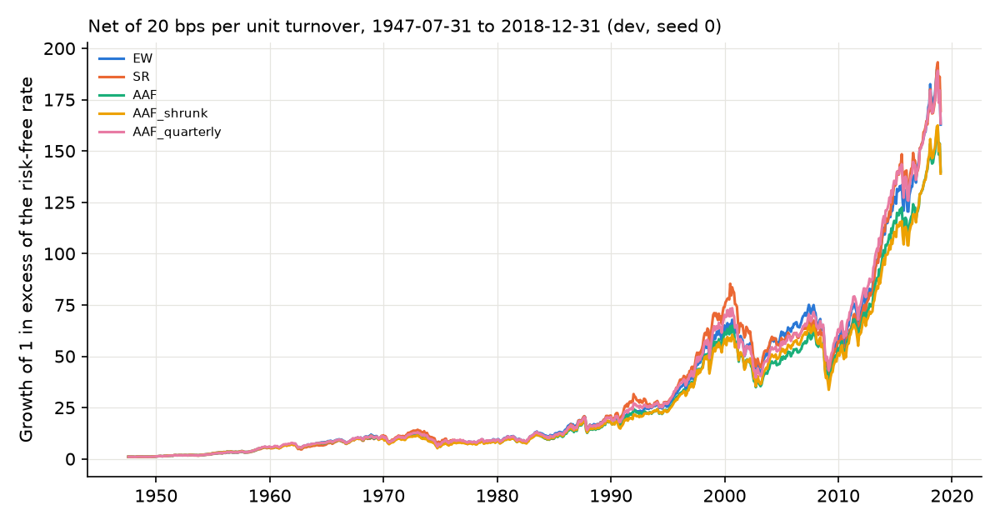
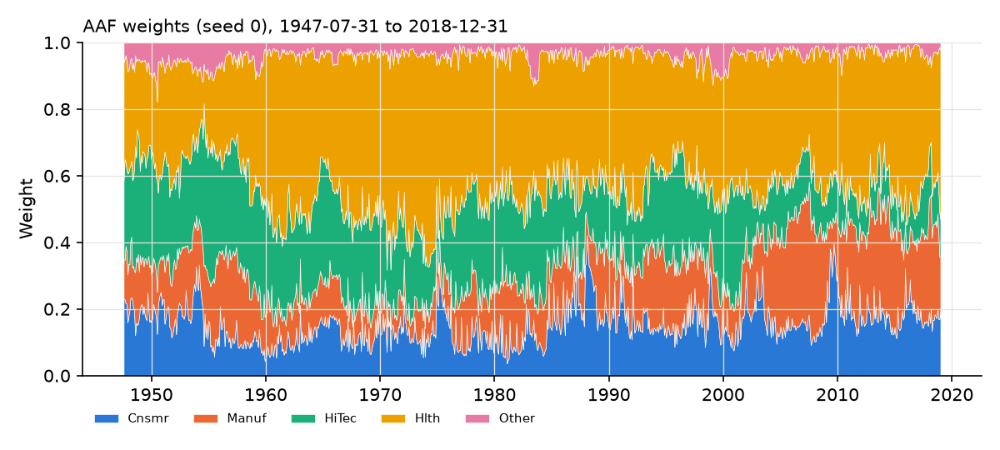

# Results: transfer_french5_dev

Generated from `results/transfer_french5_dev/` (config `2edeb4d0f2a4`, source tree `3f7791215aca`). 858 months, 1947-07-31 to 2018-12-31. Status: development. Seeds: [0, 1, 2].

## Table 5 analogue (means over seeds; costs 20 bps per unit turnover)

TO: annualized turnover (%); SD: annualized SD of excess returns (%); CW: cumulative wealth incl. the risk-free rate; SR: annualized Sharpe of excess returns; BE: cost at which net wealth equals EW's net wealth on the same trade schedules (NaN = behind EW at zero cost, inf = no crossing).

| strategy           |   TO_pct |   SD_pct |       CW |    SR |   SR_seed_sd |   MaxDD |   CW_net |   SR_net |   BE_bps |
|:-------------------|---------:|---------:|---------:|------:|-------------:|--------:|---------:|---------:|---------:|
| EW                 |   18.277 |   14.430 | 2834.110 | 0.571 |        0.000 |  47.239 | 2756.221 |    0.568 |  nan     |
| SR                 |   31.107 |   15.530 | 2999.452 | 0.546 |        0.000 |  46.617 | 2865.307 |    0.541 |   63.309 |
| AAF                |  166.661 |   14.503 | 3078.757 | 0.576 |        0.002 |  46.636 | 2426.682 |    0.553 |    7.886 |
| AAF_shrunk         |   39.670 |   14.507 | 2503.132 | 0.556 |        0.001 |  47.863 | 2361.276 |    0.550 |  nan     |
| AAF_alpha0.5_fixed |   84.770 |   14.385 | 2978.192 | 0.577 |        0.001 |  46.898 | 2636.064 |    0.565 |   10.547 |
| AAF_band           |   53.226 |   14.473 | 3085.425 | 0.577 |        0.006 |  46.243 | 2856.771 |    0.570 |   35.116 |
| AAF_quarterly      |   64.916 |   14.506 | 3088.252 | 0.577 |        0.002 |  47.143 | 2811.300 |    0.567 |   26.017 |

## Joint block bootstrap of net Sharpe differences (seed 0, 12-month blocks)

|                             |   diff |   ci_lo |   ci_hi |   p_le_0 |
|:----------------------------|-------:|--------:|--------:|---------:|
| SR_minus_EW                 | -0.026 |  -0.126 |   0.074 |    0.712 |
| AAF_minus_EW                | -0.017 |  -0.075 |   0.043 |    0.721 |
| AAF_shrunk_minus_EW         | -0.018 |  -0.035 |  -0.003 |    0.992 |
| AAF_band_minus_EW           | -0.005 |  -0.063 |   0.056 |    0.573 |
| AAF_quarterly_minus_EW      | -0.003 |  -0.064 |   0.059 |    0.548 |
| AAF_alpha0.5_fixed_minus_EW | -0.004 |  -0.033 |   0.026 |    0.621 |
| AAF_shrunk_minus_AAF        | -0.001 |  -0.051 |   0.050 |    0.489 |
| AAF_band_minus_AAF          |  0.012 |  -0.001 |   0.027 |    0.038 |
| AAF_quarterly_minus_AAF     |  0.015 |   0.005 |   0.024 |    0.001 |
| SR_minus_AAF                | -0.009 |  -0.069 |   0.050 |    0.629 |

## Sequential blocks (net Sharpe, mean over seeds)

| start      |   AAF |   AAF_alpha0.5_fixed |   AAF_band |   AAF_quarterly |   AAF_shrunk |    EW |    SR |
|:-----------|------:|---------------------:|-----------:|----------------:|-------------:|------:|------:|
| 1947-07-31 |  0.99 |                 1.05 |       0.99 |            1.00 |         1.10 |  1.10 |  0.94 |
| 1952-07-31 |  1.37 |                 1.37 |       1.44 |            1.40 |         1.37 |  1.37 |  1.23 |
| 1957-07-31 |  0.62 |                 0.61 |       0.63 |            0.63 |         0.55 |  0.60 |  0.47 |
| 1962-07-31 |  1.02 |                 1.04 |       1.00 |            1.01 |         1.05 |  1.05 |  1.01 |
| 1967-07-31 |  0.35 |                 0.30 |       0.36 |            0.37 |         0.25 |  0.25 |  0.51 |
| 1972-07-31 | -0.31 |                -0.26 |      -0.29 |           -0.28 |        -0.27 | -0.21 | -0.36 |
| 1977-07-31 |  0.07 |                 0.07 |       0.09 |            0.09 |         0.08 |  0.08 |  0.17 |
| 1982-07-31 |  1.07 |                 1.10 |       1.08 |            1.09 |         1.13 |  1.13 |  1.05 |
| 1987-07-31 |  0.36 |                 0.32 |       0.39 |            0.39 |         0.26 |  0.27 |  0.46 |
| 1992-07-31 |  1.26 |                 1.36 |       1.26 |            1.27 |         1.42 |  1.45 |  1.05 |
| 1997-07-31 |  0.08 |                 0.14 |       0.13 |            0.08 |         0.16 |  0.18 |  0.11 |
| 2002-07-31 |  0.81 |                 0.80 |       0.79 |            0.83 |         0.78 |  0.78 |  0.58 |
| 2007-07-31 |  0.28 |                 0.22 |       0.30 |            0.28 |         0.16 |  0.16 |  0.26 |
| 2012-07-31 |  1.26 |                 1.36 |       1.28 |            1.27 |         1.41 |  1.45 |  1.37 |

## Leaf-solver and ensemble diagnostics

|                                         |     value |
|:----------------------------------------|----------:|
| refits                                  | 72        |
| leaf solves (seed 0)                    |  3.48e+06 |
| exact-path fallbacks                    |  2.13e+03 |
| max |global objective - multistart ref| |  1.86e-14 |
| max global feasibility residual         |  6.69e-16 |
| max (relaxed - equality) objective      | -5.92e-11 |
| min relaxed var / EW var                |  1        |
| max cond(train covariance)              | 99.8      |
| mean forest fit seconds                 |  2.3      |

Ex-ante volatility of the averaged forest portfolio relative to the EW target, using each refit's training covariance: mean 0.967, min 0.939, max 0.987. Averaging leaf portfolios that each satisfy the equality lands inside the volatility ball, not on it.

