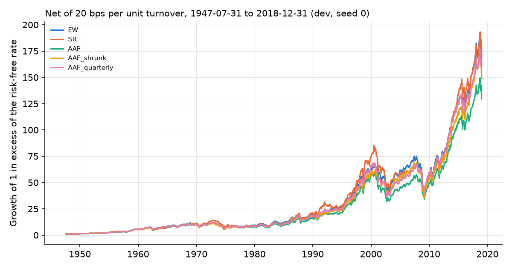
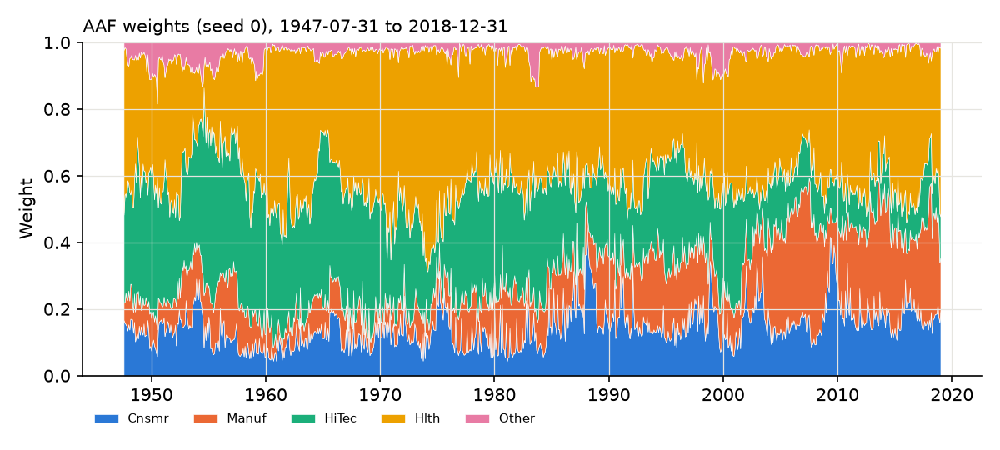

# Results: transfer_french5_dev_relaxed

Generated from `results/transfer_french5_dev_relaxed/` (config `2edeb4d0f2a4`, source tree `3f7791215aca`). 858 months, 1947-07-31 to 2018-12-31. Status: development. Seeds: [0, 1, 2].

## Table 5 analogue (means over seeds; costs 20 bps per unit turnover)

TO: annualized turnover (%); SD: annualized SD of excess returns (%); CW: cumulative wealth incl. the risk-free rate; SR: annualized Sharpe of excess returns; BE: cost at which net wealth equals EW's net wealth on the same trade schedules (NaN = behind EW at zero cost, inf = no crossing).

| strategy           |   TO_pct |   SD_pct |       CW |    SR |   SR_seed_sd |   MaxDD |   CW_net |   SR_net |   BE_bps |
|:-------------------|---------:|---------:|---------:|------:|-------------:|--------:|---------:|---------:|---------:|
| EW                 |   18.277 |   14.430 | 2834.110 | 0.571 |        0.000 |  47.239 | 2756.221 |    0.568 |  nan     |
| SR                 |   31.107 |   15.530 | 2999.452 | 0.546 |        0.000 |  46.617 | 2865.307 |    0.541 |   63.309 |
| AAF                |  170.770 |   14.482 | 2813.845 | 0.568 |        0.002 |  46.873 | 2204.681 |    0.544 |    0.812 |
| AAF_shrunk         |   31.160 |   14.499 | 2589.902 | 0.560 |        0.002 |  48.712 | 2472.714 |    0.555 |  nan     |
| AAF_alpha0.5_fixed |   86.691 |   14.369 | 2848.812 | 0.573 |        0.001 |  47.015 | 2514.559 |    0.561 |    1.853 |
| AAF_band           |   58.842 |   14.496 | 2916.210 | 0.571 |        0.002 |  46.583 | 2677.733 |    0.563 |    9.930 |
| AAF_quarterly      |   69.795 |   14.487 | 2877.747 | 0.570 |        0.002 |  47.259 | 2601.513 |    0.560 |    4.235 |

## Joint block bootstrap of net Sharpe differences (seed 0, 12-month blocks)

|                             |   diff |   ci_lo |   ci_hi |   p_le_0 |
|:----------------------------|-------:|--------:|--------:|---------:|
| SR_minus_EW                 | -0.026 |  -0.126 |   0.074 |    0.712 |
| AAF_minus_EW                | -0.024 |  -0.087 |   0.039 |    0.775 |
| AAF_shrunk_minus_EW         | -0.010 |  -0.023 |   0.000 |    0.971 |
| AAF_band_minus_EW           | -0.006 |  -0.071 |   0.056 |    0.583 |
| AAF_quarterly_minus_EW      | -0.009 |  -0.072 |   0.056 |    0.622 |
| AAF_alpha0.5_fixed_minus_EW | -0.008 |  -0.039 |   0.023 |    0.697 |
| AAF_shrunk_minus_AAF        |  0.014 |  -0.044 |   0.073 |    0.312 |
| AAF_band_minus_AAF          |  0.018 |   0.005 |   0.031 |    0.005 |
| AAF_quarterly_minus_AAF     |  0.015 |   0.005 |   0.026 |    0.002 |
| SR_minus_AAF                | -0.002 |  -0.066 |   0.061 |    0.541 |

## Sequential blocks (net Sharpe, mean over seeds)

| start      |   AAF |   AAF_alpha0.5_fixed |   AAF_band |   AAF_quarterly |   AAF_shrunk |    EW |    SR |
|:-----------|------:|---------------------:|-----------:|----------------:|-------------:|------:|------:|
| 1947-07-31 |  0.94 |                 1.03 |       0.95 |            0.95 |         1.09 |  1.10 |  0.94 |
| 1952-07-31 |  1.36 |                 1.38 |       1.42 |            1.41 |         1.37 |  1.37 |  1.23 |
| 1957-07-31 |  0.64 |                 0.63 |       0.66 |            0.66 |         0.56 |  0.60 |  0.47 |
| 1962-07-31 |  0.97 |                 1.02 |       0.98 |            0.98 |         1.05 |  1.05 |  1.01 |
| 1967-07-31 |  0.32 |                 0.29 |       0.33 |            0.32 |         0.25 |  0.25 |  0.51 |
| 1972-07-31 | -0.30 |                -0.26 |      -0.25 |           -0.27 |        -0.25 | -0.21 | -0.36 |
| 1977-07-31 |  0.04 |                 0.06 |       0.08 |            0.07 |         0.08 |  0.08 |  0.17 |
| 1982-07-31 |  1.05 |                 1.09 |       1.06 |            1.07 |         1.13 |  1.13 |  1.05 |
| 1987-07-31 |  0.35 |                 0.31 |       0.38 |            0.39 |         0.27 |  0.27 |  0.46 |
| 1992-07-31 |  1.28 |                 1.37 |       1.27 |            1.30 |         1.45 |  1.45 |  1.05 |
| 1997-07-31 |  0.09 |                 0.14 |       0.10 |            0.08 |         0.16 |  0.18 |  0.11 |
| 2002-07-31 |  0.81 |                 0.80 |       0.77 |            0.83 |         0.78 |  0.78 |  0.58 |
| 2007-07-31 |  0.27 |                 0.21 |       0.29 |            0.28 |         0.16 |  0.16 |  0.26 |
| 2012-07-31 |  1.26 |                 1.36 |       1.30 |            1.27 |         1.45 |  1.45 |  1.37 |

## Leaf-solver and ensemble diagnostics

|                                         |     value |
|:----------------------------------------|----------:|
| refits                                  | 72        |
| leaf solves (seed 0)                    |  3.52e+06 |
| exact-path fallbacks                    |  1.55e+03 |
| max |global objective - multistart ref| |  1.86e-14 |
| max global feasibility residual         |  6.69e-16 |
| max (relaxed - equality) objective      | -5.92e-11 |
| min relaxed var / EW var                |  1        |
| max cond(train covariance)              | 99.8      |
| mean forest fit seconds                 |  1.78     |

Ex-ante volatility of the averaged forest portfolio relative to the EW target, using each refit's training covariance: mean 0.960, min 0.920, max 0.986. Averaging leaf portfolios that each satisfy the equality lands inside the volatility ball, not on it.

