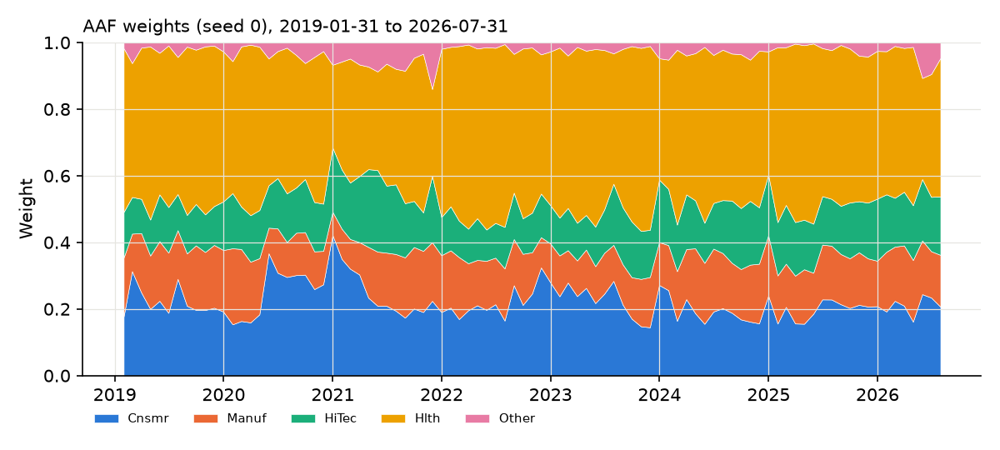

# Results: transfer_french5_final

Generated from `results/transfer_french5_final/` (config `2edeb4d0f2a4`, source tree `3f7791215aca`). 91 months, 2019-01-31 to 2026-07-31. Status: final evaluation (reserved sample). Seeds: [0, 1, 2].

## Table 5 analogue (means over seeds; costs 20 bps per unit turnover)

TO: annualized turnover (%); SD: annualized SD of excess returns (%); CW: cumulative wealth incl. the risk-free rate; SR: annualized Sharpe of excess returns; BE: cost at which net wealth equals EW's net wealth on the same trade schedules (NaN = behind EW at zero cost, inf = no crossing).

| strategy           |   TO_pct |   SD_pct |    CW |    SR |   SR_seed_sd |   MaxDD |   CW_net |   SR_net |   BE_bps |
|:-------------------|---------:|---------:|------:|------:|-------------:|--------:|---------:|---------:|---------:|
| EW                 |   23.957 |   16.016 | 3.029 | 0.831 |        0.000 |  20.955 |    3.018 |    0.828 |      nan |
| SR                 |   27.230 |   14.585 | 2.470 | 0.710 |        0.000 |  17.926 |    2.460 |    0.707 |      nan |
| AAF                |  180.044 |   14.653 | 2.741 | 0.802 |        0.005 |  18.761 |    2.668 |    0.778 |      nan |
| AAF_shrunk         |   40.232 |   15.811 | 2.958 | 0.820 |        0.005 |  20.629 |    2.941 |    0.815 |      nan |
| AAF_alpha0.5_fixed |   91.395 |   15.220 | 2.886 | 0.823 |        0.003 |  19.844 |    2.847 |    0.812 |      nan |
| AAF_band           |   62.353 |   14.848 | 2.763 | 0.801 |        0.010 |  18.579 |    2.738 |    0.793 |      nan |
| AAF_quarterly      |   65.329 |   14.857 | 2.728 | 0.789 |        0.007 |  19.332 |    2.701 |    0.781 |      nan |

## Joint block bootstrap of net Sharpe differences (seed 0, 12-month blocks)

|                             |   diff |   ci_lo |   ci_hi |   p_le_0 |
|:----------------------------|-------:|--------:|--------:|---------:|
| SR_minus_EW                 | -0.121 |  -0.432 |   0.128 |    0.833 |
| AAF_minus_EW                | -0.053 |  -0.224 |   0.085 |    0.796 |
| AAF_shrunk_minus_EW         | -0.009 |  -0.023 |   0.002 |    0.942 |
| AAF_band_minus_EW           | -0.046 |  -0.211 |   0.073 |    0.767 |
| AAF_quarterly_minus_EW      | -0.044 |  -0.183 |   0.067 |    0.807 |
| AAF_alpha0.5_fixed_minus_EW | -0.018 |  -0.097 |   0.046 |    0.723 |
| AAF_shrunk_minus_AAF        |  0.044 |  -0.093 |   0.213 |    0.255 |
| AAF_band_minus_AAF          |  0.007 |  -0.042 |   0.054 |    0.404 |
| AAF_quarterly_minus_AAF     |  0.009 |  -0.041 |   0.071 |    0.363 |
| SR_minus_AAF                | -0.068 |  -0.225 |   0.059 |    0.863 |

## Sequential blocks (net Sharpe, mean over seeds)

| start      |   AAF |   AAF_alpha0.5_fixed |   AAF_band |   AAF_quarterly |   AAF_shrunk |   EW |   SR |
|:-----------|------:|---------------------:|-----------:|----------------:|-------------:|-----:|-----:|
| 2019-01-31 |  0.70 |                 0.72 |       0.72 |            0.69 |         0.72 | 0.73 | 0.65 |
| 2024-01-31 |  1.09 |                 1.19 |       1.09 |            1.14 |         1.21 | 1.23 | 0.87 |

## Leaf-solver and ensemble diagnostics

Scored months only (91 months; the 9 refits whose forests set their weights, 2018-07-31 to 2026-07-31; `scripts/evaluation_diagnostics.py`): leaf solves 567,832, exact-path fallbacks 332, max global feasibility residual 3.2e-16. Ex-ante volatility of the averaged forest portfolio relative to the EW target, using each refit's training covariance: mean 0.973, min 0.968, max 0.986.

Whole walk-forward since 1947-07-31 (949 months, 80 refits, including the development months that precede the scored period):

|                                         |     value |
|:----------------------------------------|----------:|
| refits                                  | 80        |
| leaf solves (seed 0)                    |  3.99e+06 |
| exact-path fallbacks                    |  2.42e+03 |
| max |global objective - multistart ref| |  1.86e-14 |
| max global feasibility residual         |  6.69e-16 |
| max (relaxed - equality) objective      | -5.92e-11 |
| min relaxed var / EW var                |  1        |
| max cond(train covariance)              | 99.8      |
| mean forest fit seconds                 |  2.72     |

Whole walk-forward: ex-ante volatility of the averaged forest portfolio relative to the EW target, using each refit's training covariance: mean 0.967, min 0.939, max 0.987. Averaging leaf portfolios that each satisfy the equality lands inside the volatility ball, not on it.

