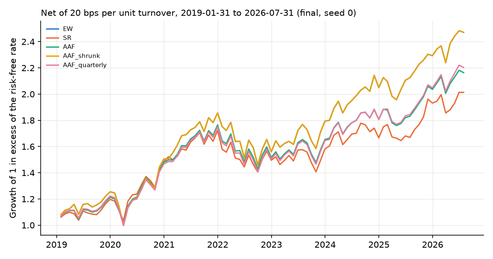
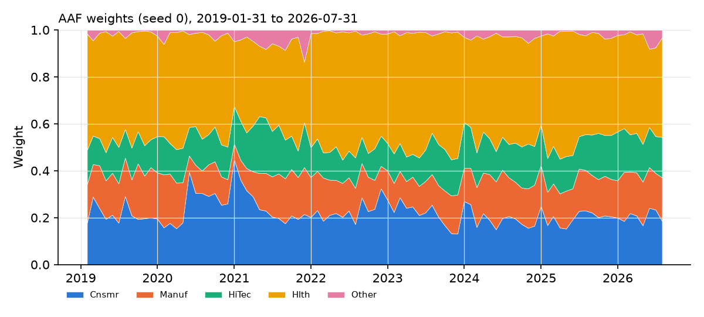

# Results: transfer_french5_final_relaxed

Generated from `results/transfer_french5_final_relaxed/` (config `2edeb4d0f2a4`, source tree `3f7791215aca`). 91 months, 2019-01-31 to 2026-07-31. Status: final evaluation (reserved sample). Seeds: [0, 1, 2].

## Table 5 analogue (means over seeds; costs 20 bps per unit turnover)

TO: annualized turnover (%); SD: annualized SD of excess returns (%); CW: cumulative wealth incl. the risk-free rate; SR: annualized Sharpe of excess returns; BE: cost at which net wealth equals EW's net wealth on the same trade schedules (NaN = behind EW at zero cost, inf = no crossing).

| strategy           |   TO_pct |   SD_pct |    CW |    SR |   SR_seed_sd |   MaxDD |   CW_net |   SR_net |   BE_bps |
|:-------------------|---------:|---------:|------:|------:|-------------:|--------:|---------:|---------:|---------:|
| EW                 |   23.957 |   16.016 | 3.029 | 0.831 |        0.000 |  20.955 |    3.018 |    0.828 |      nan |
| SR                 |   27.230 |   14.585 | 2.470 | 0.710 |        0.000 |  17.926 |    2.460 |    0.707 |      nan |
| AAF                |  180.993 |   14.634 | 2.720 | 0.796 |        0.006 |  18.814 |    2.647 |    0.772 |      nan |
| AAF_shrunk         |   23.957 |   16.016 | 3.029 | 0.831 |        0.000 |  20.955 |    3.018 |    0.828 |      nan |
| AAF_alpha0.5_fixed |   91.566 |   15.212 | 2.875 | 0.820 |        0.003 |  19.871 |    2.836 |    0.809 |      nan |
| AAF_band           |   61.518 |   14.745 | 2.804 | 0.819 |        0.021 |  18.606 |    2.778 |    0.811 |      nan |
| AAF_quarterly      |   69.866 |   14.853 | 2.713 | 0.785 |        0.006 |  19.506 |    2.684 |    0.775 |      nan |

## Joint block bootstrap of net Sharpe differences (seed 0, 12-month blocks)

|                             |   diff |   ci_lo |   ci_hi |   p_le_0 |
|:----------------------------|-------:|--------:|--------:|---------:|
| SR_minus_EW                 | -0.121 |  -0.432 |   0.128 |    0.833 |
| AAF_minus_EW                | -0.057 |  -0.220 |   0.073 |    0.817 |
| AAF_shrunk_minus_EW         |  0.000 |   0.000 |   0.000 |    1.000 |
| AAF_band_minus_EW           |  0.007 |  -0.172 |   0.143 |    0.487 |
| AAF_quarterly_minus_EW      | -0.051 |  -0.187 |   0.062 |    0.843 |
| AAF_alpha0.5_fixed_minus_EW | -0.020 |  -0.094 |   0.042 |    0.755 |
| AAF_shrunk_minus_AAF        |  0.057 |  -0.073 |   0.220 |    0.183 |
| AAF_band_minus_AAF          |  0.064 |   0.022 |   0.095 |    0.004 |
| AAF_quarterly_minus_AAF     |  0.006 |  -0.037 |   0.059 |    0.392 |
| SR_minus_AAF                | -0.064 |  -0.229 |   0.064 |    0.841 |

## Sequential blocks (net Sharpe, mean over seeds)

| start      |   AAF |   AAF_alpha0.5_fixed |   AAF_band |   AAF_quarterly |   AAF_shrunk |   EW |   SR |
|:-----------|------:|---------------------:|-----------:|----------------:|-------------:|-----:|-----:|
| 2019-01-31 |  0.69 |                 0.72 |       0.73 |            0.68 |         0.73 | 0.73 | 0.65 |
| 2024-01-31 |  1.09 |                 1.18 |       1.11 |            1.15 |         1.23 | 1.23 | 0.87 |

## Leaf-solver and ensemble diagnostics

Scored months only (91 months; the 9 refits whose forests set their weights, 2018-07-31 to 2026-07-31; `scripts/evaluation_diagnostics.py`): leaf solves 570,537, exact-path fallbacks 253, max global feasibility residual 3.2e-16. Ex-ante volatility of the averaged forest portfolio relative to the EW target, using each refit's training covariance: mean 0.972, min 0.967, max 0.986.

Whole walk-forward since 1947-07-31 (949 months, 80 refits, including the development months that precede the scored period):

|                                         |     value |
|:----------------------------------------|----------:|
| refits                                  | 80        |
| leaf solves (seed 0)                    |  4.03e+06 |
| exact-path fallbacks                    |  1.76e+03 |
| max |global objective - multistart ref| |  1.86e-14 |
| max global feasibility residual         |  6.69e-16 |
| max (relaxed - equality) objective      | -5.92e-11 |
| min relaxed var / EW var                |  1        |
| max cond(train covariance)              | 99.8      |
| mean forest fit seconds                 |  2.13     |

Whole walk-forward: ex-ante volatility of the averaged forest portfolio relative to the EW target, using each refit's training covariance: mean 0.961, min 0.920, max 0.986. Averaging leaf portfolios that each satisfy the equality lands inside the volatility ball, not on it.

